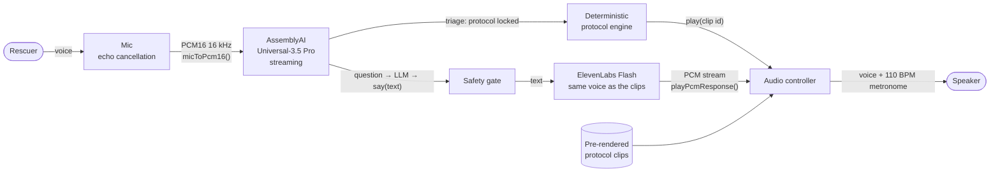

# KeepAlive — audio layer

**When seconds count, your hands should save a life, not hold a phone.**

KeepAlive talks a bystander through CPR, hands-free. The rescuer speaks;
AssemblyAI listens; a locked protocol decides what happens next; one calm voice
tells them what to do over a 110 BPM compression beat.

This repository is the audio side of the project, built for the
[AssemblyAI Voice Agent Hackathon](https://lablab.ai/ai-hackathons/assemblyai-voice-agent-hackathon):
the pre-rendered protocol voice, the browser audio engine that plays it with
near-zero delay, and a reference endpoint that speaks the AI agent's answers in
the same voice after a deterministic safety check.

> KeepAlive coaches; it does not replace emergency services.

## Design: deterministic where safety matters, generative where flexibility matters



- **AssemblyAI provides the ears, but it never makes the medical decision.** The
  triage agent only reports what it understood; every critical instruction comes
  from a locked protocol and a pre-recorded clip.
- **Every word the AI says passes a deterministic check before it's spoken.**
  No doses, no "stop compressions", no pulse checks, nothing by mouth, short
  answers during CPR (`server/safety_gate.py`).
- **One voice, all the time.** The agent doesn't speak with its own TTS: its
  answers are voiced with the same ElevenLabs voice and settings as the clips.

## Measured

All numbers measured on a MacBook in Chrome, Sep 2026.

| What | Result |
|---|---|
| Protocol clip, trigger → audible | **21 ms** (33 ms when it cuts another line) |
| Live answer, text → Sarah audible | **294–361 ms** (ElevenLabs first audio ~220 ms) |
| Clip loudness | -14.1 to -14.2 LUFS, -1.3 dBTP, 48 kHz mono |
| Metronome | 3 kHz click, -3 dBFS; -7 dBFS under the voice (-4 dB duck, 40 ms / 150 ms) |
| Mic while the app speaks | open by default: echo cancellation + a backend echo filter, so the rescuer can interrupt; an optional gate mutes it by 58 dB |
| Mic → streaming STT frames | base64 PCM16 (16 kHz for AssemblyAI streaming, 24 kHz for the voice path), 20 per second, resampling checked with a 440 Hz tone |
| App voice leaking into the mic | echo cancellation removes 32 dB; a shouting rescuer is 39 dB above the leak |
| Live answer, ElevenLabs response | median 141 ms with a pooled, pre-warmed connection (244 ms without) |
| Safety gate and `/speak` router | 29 tests, no network needed |

## Quick start

```bash
pip install -r server/requirements.txt
echo "ELEVENLABS_API_KEY=..." > .env          # needs Text to Speech + Voices read

python3 tools/render_directives.py placeholder # or: render --voice-id <id>
python3 server/speak_server.py                 # bench + /speak at http://localhost:8766
python3 -m pytest -q server                    # safety gate tests
```

Without a key, `python3 -m http.server 8765 -d web` serves everything except
the live answer panel.

| Page | What it's for |
|---|---|
| `/` | Test bench: scenarios, level scope, queue, event log, live answer panel |
| `/audition.html` | Compare candidate voices over the metronome (run `render_directives.py audition` first — auditions aren't committed) |
| `/leak-test.html` | Measure how much of the app's voice reaches the mic |

## Using the audio controller

One ES module, no dependencies: `web/audio-controller.js`.

```js
import { AudioController } from './audio-controller.js';

const audio = new AudioController();
await audio.load('audio/manifest.json');
await audio.unlock();                        // inside the Emergency tap handler
audio.startMetronome(110);

audio.play('cpr_01_confirm');                // a pre-rendered protocol line, by id
audio.userSpeaking(true);                    // caller started talking: our line steps back
audio.userSpeaking(false);                   // and comes back when they stop

const stop = await audio.micToPcm16(micStream, {   // 16 kHz PCM16 for streaming STT
  onFrame: (b64) => ws.send(JSON.stringify({ audio_data: b64 })),
});

const res = await fetch('/speak', {
  method: 'POST',
  headers: { 'Content-Type': 'application/json' },
  body: JSON.stringify({ text, protocol_state: 'active' }),
});
await audio.playPcmResponse(res, { text });  // the agent's answer, in the app's voice

audio.addEventListener('clipstart', (e) => e.detail);  // id, text, latencyMs → captions, HUD pill
audio.addEventListener('gate', (e) => e.detail.gated); // true while the app is speaking
```

Priorities: a **critical** line (agonal breathing) cuts anything, including a
live answer; a **response** waits for the current line and jumps ahead of queued
protocol lines; **normal** protocol lines play in order. The same clip is never
stacked twice.

## Protocol lines

| id | priority | line |
|---|---|---|
| `cpr_01_confirm` | normal | Don't panic. 911 CAD dispatch has been alerted with your exact GPS location. We need to start CPR immediately! Lay them flat on firm ground. |
| `cpr_02_agonal` | critical | Do not stop. Gasping is agonal breathing, not normal breathing. Kneel beside their chest immediately. |
| `cpr_03_position` | normal | Put heel of hand on center of chest, lock your elbows straight. |
| `cpr_04_start_beat` | normal | Ready: 3… 2… 1… PUSH! Push hard and fast to the beat… |
| `cpr_05_recoil` | normal | Keep pushing to the beat. Allow full chest recoil… |
| `cpr_07_aed` | normal | If anyone is with you, send them to find an AED right now… |
| `cpr_06_paramedics` | normal | Stop compressions and step back. Let the paramedics take over… |
| `qa_rib_pop`, `qa_bed_surface`, `qa_vomit`, `qa_tired`, `qa_fallback` | response | instant answers to the most common questions |

Full text in `tools/render_directives.py`. The lines are rendered word for word
from the protocol engine's own wording, so the backend's echo filter can match
them. The rhythm follows the 2025 AHA Adult BLS guidelines (100–120 compressions
per minute); the depth wording ("two inches" vs the AHA's "at least two inches")
is still with the protocol owner.

## Layout

```
tools/render_directives.py   ElevenLabs → trimmed, loudness-normalised WAV + manifest
web/audio-controller.js      the audio engine
web/audio/                   the 11 protocol clips (voice: Sarah)
web/index.html               test bench
web/audition.html            voice audition
web/leak-test.html           mic leak measurement
server/speak_router.py       /speak as a FastAPI router: gate → ElevenLabs → PCM stream
server/speak_server.py       local server: the bench + /speak on one origin
server/safety_gate.py        the deterministic text gate (+ tests)
server/INTEGRATION.md        how to include /speak in the team backend
docs/agent-spec.md           agent prompt, the say() tool, the gate and 30 test questions
docs/demo-voiceover.md       demo video script
video/voiceover/             demo narration (voice: Eric)
```

## License

MIT — see [LICENSE](LICENSE).
